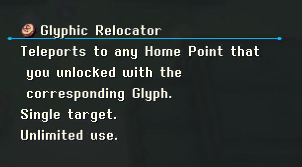
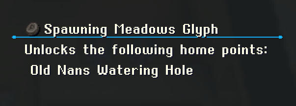
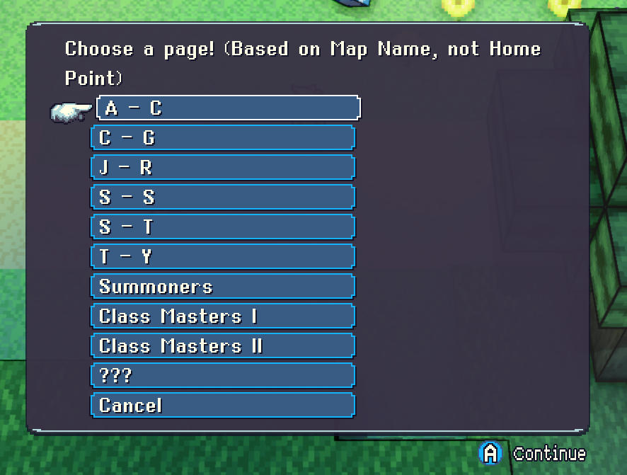
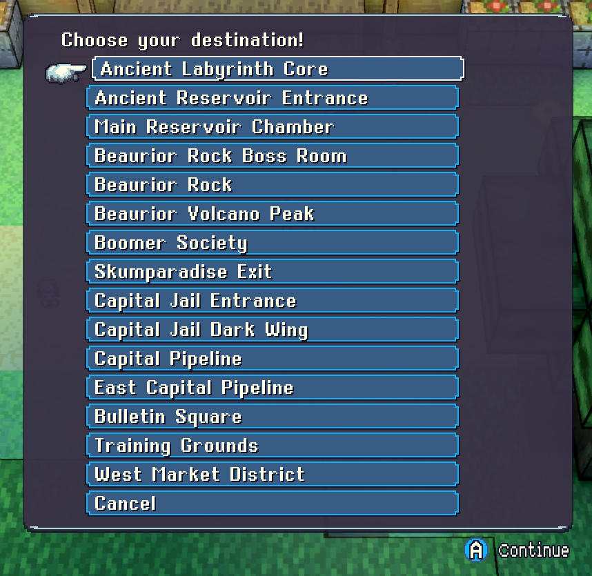

# ✴️ The Glyphic Relocator Crystal Project Mod ✴️

## Home Point Teleport Free Version
> [!CAUTION]
> Not recommended for your first playthrough

Adds the Glyphic Relocator and more then 120 fast travel locations to the game.

- All home points
- All Summoner Challenges
- All Class Masters
- Additional bonus locations

You get it automatically when you start a new game or you can get it from the Nan that gave you your first map.

This version has all teleport locations automatically enabled without the need for the glyphs.

## Home Point Teleport

> [!NOTE]
> Can be a nice addition, even in your first playthrough

Adds the Glyphic Relocator and more then 120 fast travel locations to the game.

- All home points
- All Summoner Challenges
- All Class Masters
- Additional bonus locations

You get it automatically when you start a new game or you can get it from the Nan that gave you your first map.

This version requires you to find 30+ glyph items hidden throughout the world. Each glyph enables their corresponding home point(s).

As an example: The **Capital Sequoia Glyph** unlocks the following home points in the Glyphic Relocator

* Bulletin Square
* Training Grounds
* West Market District
* Know-It-All Ducks' House
* East Market District
* Castle Sequoia Foyer

I hope you enjoy this little mod. I put a lot of work and effort into it.

## Screenshots

## Glyph Locations
I highly encourage you to try and find the glyphs by yourself. It's part of the adventure.
But if you really can't find <u>*that one glyph*</u>, feel free to check in the [Glyph Location Reference](https://github.com/Gibdos/CrystalProject_Mods/blob/8119b7f881bc2a6fbc2a7f6c4a6b60c218fe9851/mods/Home%20Point%20Teleporter/Glyph_Location_Reference.pdf).

## Compatibility & Testing
* The mod has been tested with version 1.6.1
* All glyphs have been tested and are obtainable when starting a new game
* All glyphs have been tested and ***should*** be obtainable if the mod is used otherwise
    * If I missed any strange situations and a glyph is unobtainable, feel free to open an issue

## How to install the mod
* Download the mods
* Copy the .json file to either
    * **Windows**: *%USERPROFILE%/Saved Games/Crystal Project/Mods/*
    * **MacOS**: *~/Library/Application Support/Crystal Project/Mods/*
    * **Linux**: *~/.local/share/Crystal Project/Mods/*
* Enable the mod in-game

## ToDo

- [X] Add all regular home points
- [X] Check if all glyphs are obtainable
- [X] Add additional non home point locations
- [X] Add Class Master locations
- [X] Add Summoner locations
- [ ] Find out how to upload the mod to Steam without owning the Steam version

## Known Bugs
- Occasional bug when teleporting from underwater
    - Can be fixed by just teleporting again or first using a shrine stone / shard
- When canceling out of the page menu you get warped to your last used location

## Special Thanks
A special thanks goes out to **@Rafidur** and **#Z`** on the official Discord server. Without your help at the beginning none of this would have worked out.